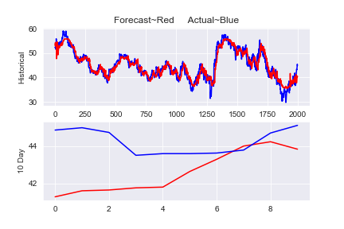

# Noisy Exponential Activation Function (NEAF)
This repository contains a research project I performed. The project is focused around the implementation of a custom 
activation function I created called the Noisy Exponential Activation Function, NEAF. NEAF injects noise into the network and maps the data to a set range. Unlike previous noise injecting activation functions, NEAF injects noise dampened over an exponential function allowing for the activation function to serve as a regressor and also preserve the non-linear attributes desired from an activation function. In this repository, you can find an implementation of NEAF on a Deep Recurrent Attention Unit built from scratch using Numpy example for Time Series forecasting for stock data. You can also find an individual implementation of NEAF and a pdf for the mathematical deviations for a Recurrent Attention Unit. 


### Prerequisites
Python3: numpy, pandas, sklearn, matplotlib, seaborn

### Installing
```
 pip install numpy pandas sklearn matplotlib seaborn
```

## Running the Network

### Import data, scale, and split into windows

The network is tested with the Iris data set. The training samples and test samples, X, need to be a numpy array with the shape of (sample, features). The labels of the training samples and test samples, Y, need the class labels to be assigned to natural numbers (1, 2, 3, 4, .....) and also be in the form of a numpy array. The values of X need to be scaled to the interval of (0,1).

```
# BEGIN: Import data
    ticker_symbol = 'ABT' #Select asset ticker symbol
    data = pd.read_excel(ticker_symbol+'.xlsx')
    date = data['date'].tolist()
    data = data.drop('date',1)

    input_data = data.iloc[3000:5000,:].values # day 4500 to 5000 for training
    target_data = data.iloc[3010:5010,-1].values  # day 4510 to 5010 for target, target is Average Price
    test_target_data = data.iloc[3010:5010,:].values # day 4510 to 5010 for test, will predict days 5010-5020

    scaler = MinMaxScaler(feature_range=(0.05, .95))
    X_train = scaler.fit_transform(input_data)
    y_train = scaler.fit_transform(target_data.reshape(-1, 1))
    X_test = scaler.fit_transform(test_target_data)

    sample_size = 10 # number of days inserted per node
    num_input_var = 6 # [Open, High, Close, Low,volume, Average Price]

    #Break input data set into samples
    input_data_list = []
    for i in range(0,2000,sample_size):
        sample = X_train[i:i+sample_size].T
        input_data_list.append(sample)

    #Break target data set into samples
    target_data_list = []
    for i in range(0,2000,sample_size):
        sample = y_train[i:i+sample_size].T
        target_data_list.append(sample)

    test_data_list = []
    for i in range(0,2000,sample_size):
        sample = X_test[i:i+sample_size].T
        test_data_list.append(sample)
# END: Import data
```

### Declare network
To use the network, .

```
# BEGIN: Network Architecture
    nodes = 200  # number of nodes = (number of samples)/(sample size)
    Reset_Gate_Layers = [(num_input_var,68,'swish'),(68,'BatchNorm'),(68,num_input_var,'sigmoid')]
    Update_Gate_Layers = [(num_input_var,68,'swish'),(68,'BatchNorm'),(68,num_input_var,'sigmoid')]
    Output_Gate_Layers = [(num_input_var,68,'swish'),(68,'BatchNorm'),(68,num_input_var,'sigmoid')]
    Attention_Gate_Layer = [(sample_size,sample_size,'softmax'),(sample_size,num_input_var,'tanh')]
    Stepdown_Network_Layers = [(6,'BatchNorm'),(6, 1, "sigmoid")]
    Architecture = [Reset_Gate_Layers,Update_Gate_Layers,Output_Gate_Layers,Attention_Gate_Layer,Stepdown_Network_Layers]
# END: Network Architecture


# BEGIN: Declare and run RAU
    lr = 0.001        # Learning rate
    key_LF = "Huber"     # Cost function
    key_Opt = "Adam"  # Optimization technique
    network = RAU(nodes, Architecture, lr, key_LF, key_Opt)
    epochs = 500

    for i in range(epochs):
        print("Epoch: ", i)
        network.train(input_data_list,target_data_list)
# END: Declare and run RAU
```

### Denormalize data and print graph of results
The X inputs and Y labels need to be separated into two separate date sets, a training and test set. The X-values
are the first passed parameter for "train" and "test" functions and, the y-values are the second parameter passed for the 
"train" and "test" functions. 

```
# BEGIN: Predict and plot
    def denormalize(actual,norm_data):
        actual = actual.reshape(-1,1)
        norm_data = norm_data.reshape(-1,1)
        scl = MinMaxScaler(feature_range=(0.05, .95))
        a = scl.fit_transform(actual)
        new = scl.inverse_transform(norm_data)
        return new

    forecast = denormalize(target_data,np.concatenate(network.all_outputs, axis=1 ).T)

    sns.axes_style("darkgrid")
    sns.set_style("darkgrid")
    plt.subplot(2, 1, 1)
    # Plot historical data
    plt.title('Forecast~Red     Actual~Blue')
    plt.plot(range(2000), data.iloc[3010:5010,-1].values, 'b')
    plt.plot(range(2000), forecast,'r')
    plt.ylabel('Historical')
    # Plot prediction data
    plt.subplot(2, 1, 2)
    plt.plot(range(10), denormalize(data.iloc[3000:5010,-1].values,network.query(test_data_list)),'r')
    plt.plot(range(10), data.iloc[5010:5020,-1].values, 'b')
    plt.ylabel('10 Day')

    plt.savefig("forcast_graph.png")
    plt.show()
# END: Predict and plot
```

<p align="center">
  
</p>


## Authors

* **Enrique Nueve** 

## License

This project is licensed under the GNU General Public License v3.0 - see the [LICENSE](LICENSE) file for details

## Acknowledgments
* Guoqiang Zhong, Guohua Yue, Xiao Ling for creating the Recurrent Attention Unit.
